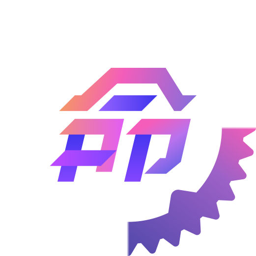

  

# Inox2D

Officially supported experimental Rust port of [Inochi2D](https://github.com/Inochi2D/inochi2d). 

The Inox2D workgroup provides support in the **#inox2d** channel on the [Inochi2D Discord](https://discord.com/invite/abnxwN6r9v).

**Currently this library and the specification is in a prototype state**, it is not recommended to use this library in production.

&nbsp;

## Rigging

If you're a model rigger you may want to check out [Inochi Creator](https://github.com/Inochi2D/inochi-creator), the official Inochi2D rigging app in development.  
This repository is purely for developers and is not useful if you're an end user.

&nbsp;

## Status

Example models are parsed and rendered correctly at this state.

However, it's the only thing that works currently. It doesn't deform, doesn't have physics, and doesn't support animations.

- [x] Rendering (at least for the two example models)
- [ ] Deform
- [ ] Physics
- [ ] Animations

Attempts to rewrite the OpenGL rendering code to be on-par with the standard Inochi2D implementation *may* be done down the line.

&nbsp;

## Implementation

Inox2D is currently a bit of a merge between [the original Inochi2D implementation](https://github.com/Inochi2D/inochi2d) in D and [Link Mauve's implementation](https://https://linkmauve.fr/dev/inochi2d/) in Rust (the [inochi2d](https://crates.io/crates/inochi2d) crate). The original is the standard, while Link's is a reverse-engineered and optimized implementation, but lacking the remaining core features that need to be implemented. His code is much simpler, but also not extensible (nodes are managed with an enum), so users of the library wouldn't be able to create custom nodes.

Inox2D is designed to be extensible. Nodes are extensible through a generic `InoxData<T>` enum which has a `Custom(T)` variant. Every other part of the library accounts for it: the OpenGL renderer accepts any struct that implements the `CustomRenderer` trait to be able to render your custom nodes, and the deserialization functions accept generic `Fn`s for deserialization of custom nodes when it is relevant.

> Note: all the shader files that are present in this repository (under `shaders/`) have been copied from the original Inochi2D implementation, but are currently not used (eventually they will, probably). Instead, it's using Link Mauve's simpler shaders.

&nbsp;

## Optimization

| Implementation        | language | OpenGL calls |
| --------------------- | -------- | ------------ |
| Inochi2D reference*   | D        | 3076         |
| Link Mauve's inochi2d | Rust     | 551          |
| Inox2D                | Rust     | 584          |

\* Reference implementation is subject to change as optimisation passes are done, additionally code is more geared towards readability than performance for implementers to be able to more easily use it as reference.

&nbsp;

## License

This project is licensed under the 2-Clause BSD license.
See [LICENSE](LICENSE) for details.